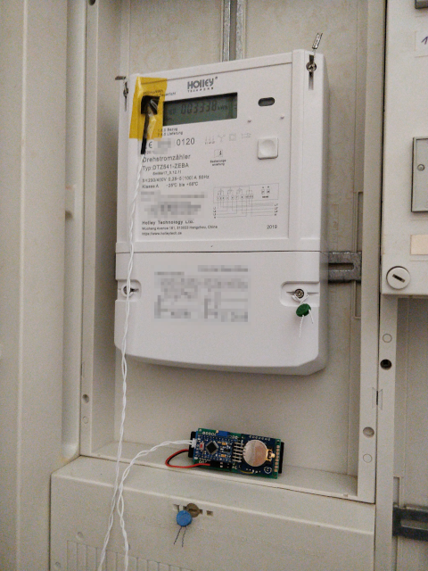

# ElectricityMeterLogger
An Arduino based solution to log your daily power consumption to an SD card.

## How it works
On most modern electricity meters there is a flashing red LED that indicates the power consumption. By utilizing a photo resistor, this LED can be used to wake up a Ardunio from deep sleep and log the time of the blink to an SD card.

## What you need
* [Ardunio Pro Mini 3.3V with Serial-Adapter](https://www.amazon.de/dp/B086ZN9M1J) (Remove the the power LED to reduce power consumption in deep sleep)
* [Tiny RTC I2C DS1307](https://www.amazon.de/dp/B07DJ4QL1L) (Remove R2 and R3 to reduce power consumption)
* [10K Poti](https://www.amazon.de/dp/B07X6RR6F8)
* [Photo Resistor](https://www.amazon.de/dp/B08SC1M7V7)
* [Li or LiPo Battery (1000mAh - 3000mAh)](https://www.amazon.de/dp/B07XF1FTGY)
* [Micro SD-Card with SD Adapter-Card](https://www.amazon.de/dp/B00M55C0VU) (Can by directly soldered to the SPI pins of the Arduino)

## Wiring

